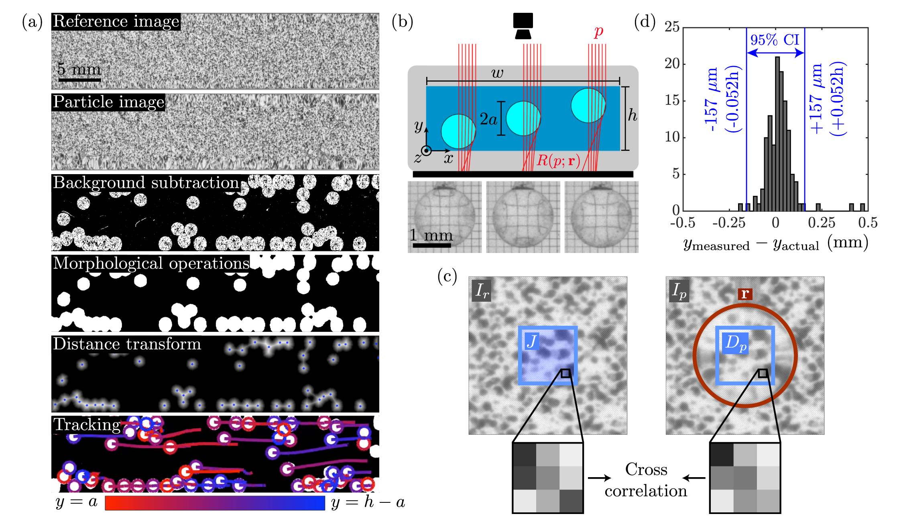

# ParticleHeight
Refraction-based single-camera 3D particle tracking

## Introduction
This code complements the article at [https://arxiv.org/abs/2302.10380](https://arxiv.org/abs/2302.10380). It is used to reconstruct the 3D positions of transparent spherical particles suspended in a channel flow based on images of these particles with a speckle pattern in the background. The optical distortion of the pattern as it is imaged through the particles essentially encodes the out-of-plane particle position and enables 3D tracking with only a single camera.

Data sets of the particle trajectories associated with the experiments and simulations in the paper are also provided. Each row contains the frame number, position (in mm, following the coordinate system in the paper), position confidence value (for experiments, based on the cross-correlation with higher values indicating a closer match) and particle ID which links the trajectory between frames.

## Installation

The ParticleHeight refraction-based 3D particle tracking code is installed using the cross-platform build system [CMake](https://cmake.org/). The dependencies are the [OpenCV](https://opencv.org/) and [NLopt](https://nlopt.readthedocs.io/en/latest/) libraries.

The trajectories are then identified using the Python linking script which utilizes the [Trackpy](http://soft-matter.github.io/trackpy/v0.5.0/) library.

## Usage

The application is run from the command line with flags to dictate the operating mode and file paths given for the input and output files. To run, open a command prompt (Windows) or a terminal (Mac) and "cd" to the directory containing the executable. Then start the program with "./ParticleHeight" followed by arguments. The first argument is a required flag specifying the operation mode to be either help, setup, calibration or processing ("-h", "-s", "-c" or "-p"). A video file (8-bit grayscale .avi) of the experiment is also required along with a reference image of the speckle pattern either as the first frame of the video or in a separate video file with a single frame. When analyzing the videos from a new experiment, the commands should be used in roughly the following order:

**Help - e.g. "./ParticleHeight -h"**

The help mode simply prints the usage message. The message is also printed if the provided arguments are incorrect in any way so it can also be accessed by simply typing "./ParticleHeight".

**Setup - e.g. "./ParticleHeight -s 20 videos/videoFile.avi settings/settingsFile.txt"**

The OpenCV GUI is used to interactively configure the image processing settings. The number of video frames to be displayed for setup can be optionally set after the "-s" flag. A video file and a text file to save the settings must be specified. A window will open to display the video frame which can be resized with the 'w'/'s' keys. The 'a' and 'd' keys can be used to traverse the video frames. The following keys can be used to toggle the various processing steps on or off: 

'b' - background subtraction

'n' - noise filtering

'm' - morphological operations

'c' - circle detection

'f' - particle height finding

'r' - switch between analytical or numerical refraction model for single particles

'h' - switch between Hough Circle Transform or Euclidean Distance Transform to find circles 

Another window will open with sliders for adjusting the processing parameters. If the specified settings text file already exists and is valid, it will be loaded and used for the default slider positions. Once the parameters have been adjusted as desired, pressing 'q' will close the GUI windows and give the option to save the settings. The name/value pairs in the settings file can also be adjusted manually if desired.

**Calibration** **- e.g. "./ParticleHeight -c 1.75 2.0 2.25 2.5 videos/videoFile.avi settings/settingsFile.txt"**

Next we use calibration mode to calibrate the refraction indices of the various media given a list of known particle heights and a video of a single particle at those heights (e.g. using a translation stage). Several trials can be concatenated together in the video as long as they all start with a reference image followed by the known height images in the same quantity and order as the provided height list. Before running the calibration, it is a good idea to manually adjust some settings in the settings file as these cannot be inferred in the setup mode (such as the correlation region size, the actual particle size, the px to mm conversion and optimizer settings). When performing the calibration, the program will attempt to adjust the refraction indices in order to minimize the error between the detected particle heights and the given height list. Once the optimization is complete, the optical parameters can be saved to the settings file.

**Process - e.g. "./ParticleHeight -p videos/videoFile.avi settings/settingsFile.txt output/results.csv output/resultVideo.avi"**

Finally, we can process all the frames of the video using our adjusted settings and save the particle positions to a csv file. There is also the option to save a binarized video in order to visualize the particles. At this point, the particle trajectories may be identified using the Python linking script, which will add an additional column of particle IDs to the csv file produced by the ParticleHeight code.

## 3D tracking details

    

Prior to each experiment, a reference image of the speckle pattern is captured without any particles in front of it. Then, throughout the experiment, a series of photographs of the test section with particles are captured. In order to extract useful information from the particle images, a number of pre-processing steps are required which are outlined in figure (a). First, background subtraction is performed using a Gaussian mixture-based segmentation algorithm (Zivkovic 2004) which applies a filter and subtracts the reference image pixel intensities from the particle image pixel intensities. Morphological opening is used to merge each particle into one connected region and the morphological closing operation removes noise from the image. In order to visualize the particle behavior, a flag may be set which requests the code to output a binarized video at this intermediate processing stage.  
  
The result is also convenient for measuring collective quantities such as the local particle area fraction $\phi$ since it is a binary image where the white pixels are particles and the black pixels are the suspending fluid. However, in order to examine the suspension dynamics with greater detail, the position of each particle needs to be determined as a function of time. As a first step towards 3D particle tracking, two components of each particle's position can determined from the Euclidean distance transform which labels the distance from each white pixel to the nearest black pixel. The 2D particle positions are taken as the regional maxima of the distance transform after the h-maxima transform (Vincent 1993) is applied to suppress shallow maxima and avoid over-segmentation.

The $y$ component of each particle's position may be inferred by comparing the reference and particle images since the speckle pattern in the particle image will be distorted depending on the particle positions. Figure (b) illustrates the working principle of this particle tracking technique. The incident rays from the camera refract at the fluid-particle interfaces and focus as they reach the pattern attached to the outside of the channel. As seen in the photographs below corresponding to each particle height, increasing the $y$ component of the particle position has the rough effect of increasing the magnification of the pattern. By applying Snell's law at each optical interface in this axisymmetric geometry, including the walls of the channel, an analytical expression may be constructed which accurately predicts the observed distortion of the pattern through the transparent particle.

The particle's position is determined by solving the inverse problem: given a reference image $I_r$ of the pattern and the resulting particle image $I_p$, find a position $\mathbf{r}$ for the particle that reproduces the observed distortion. The procedure for determining $\mathbf{r}$ is outlined in figure (c). The pre-processing steps provide an initial guess for the $x$ and $z$ components of $\mathbf{r}$ and the initial $y$ component is taken to be $h/2$. A refraction function $R(p;\mathbf{r})$ is constructed which takes a pixel index $p$ as the argument and returns the pixel index which represents the endpoint of the refracted ray. Since the optical distortion depends on the position of the particle, the refraction function $R$ is parameterized by $\mathbf{r}$. A domain $D_p$ which is centered on $\mathbf{r}$ is defined in $I_p$. A domain $J$ of the same size and position is defined in $I_r$ in which the simulated refracted image is constructed according to

$$J(p) \leftarrow I_r(R(p;\mathbf{r})) \textrm{ for all } p \textrm{ in } J$$

where $J(p)$ is the intensity of $J$ at the pixel index $p$. The normalized cross correlation (NCC) between $D_p$ and $J$ is used to measure how accurately the distortion in $I_p$ is reproduced by the guess for $\mathbf{r}$. Hence the objective is to maximize $\textrm{NCC}(D_p,J)$ over $\mathbf{r}$. The implementation of the Nelder Mead algorithm (Nelder & Mead 1965) in the NLopt library (Johnson 2021) for C++ is used to perform the optimization since it utilizes a gradient-free heuristic that works well to optimize noisy or poorly-behaved objective functions. The OpenCV library (Bradski 2000) is used to implement the image transformations and cross correlations. Although the primary goal of the optimization is to determine the $y$ component of the particle position, the $x$ and $z$ components of the particle position may be updated as well during the optimization and fine-tuned to sub-pixel precision. 

In the experimental images, lone particles as discussed here tend to be the exception with the majority of particles forming partially-overlapping clusters with their neighbors. Moreover, the ability to closely observe particle interactions is key to understanding shear-induced migration so it is essential resolve the particle positions in these cases. Since an analytical refraction model is no longer possible in the overlapping case, $R(p;\mathbf{r})$ is determined numerically by recursively propagating each incident ray from the camera through the cluster of particles until it reaches the speckle pattern (Hecht 2012). The distortion depends on the position of each particle in the cluster so they must all be optimized simultaneously; $D_p$ and $J$ domains are constructed for each particle and the average NCC is maximized. When processing a frame of an experimental video, the 2D positions from the distance transform analysis are used to tag each particle depending on whether it is overlapping its neighbors or not. The $y$ positions of the lone particles are then determined with the analytical refraction model to reduce computation time while the clusters utilize the numerical refraction method.

The tracking method requires calibration in order to precisely determine the refraction indices of the particles, fluid and channel walls. A calibration device was constructed by attaching a particle on a thin wire to a high precision translation stage. The particle may then be moved to known $y$ positions across the height of the channel while capturing images of the distorted speckle pattern. Using the algorithms described, the particle positions are measured from each image and the refraction indices are adjusted in order to minimize the sum of squared residuals between the actual particle position and the measured position. After calibration, the translation stage was used to determine the accuracy of the tracking method. Using a number of different particles at various locations in the field of view, the comparison between the measured height and the actual height reveals excellent agreement as illustrated in figure (d). Over the full measurement range, the particle's $y$ position can be determined to within 157 $\mu$m height with 95% confidence. In our setup, the particles have 1.6 mm diameter and the field of view of the channel is 40 mm by 10 mm. The monochrome CMOS camera with 2592 x 610 resolution is placed at 1 m working distance.

The final data processing step is to link the 3D particle positions into trajectories so that each particle can be tracked throughout multiple frames of the experiment. The implementation of Crocker and Grier's algorithm (Crocker & Grier 1996) in the open-source library TrackPy (Allan et al. 2021) is used to link particle trajectories. This library includes a ballistic prediction framework which is particularly suited for tracking particles in non-Brownian flows. When using the library with prediction, the algorithm predicts the expected location of each particle based on its last known velocity and looks for particles within a defined search radius of that expected position. Each particle position is linked with one in the previous frame such that the total distance between the actual particles and their predicted positions is minimized. The code is also robust to particles that enter or exit the field of view though of course only particles that remain in the field of view can be tracked for the entire experiment. Examples of reconstructed 3D particle trajectories are shown in the "tracking" frame of figure (a).

## Analytical refraction model

    

In order to simulate the distortion of the pattern when it is imaged through a particle, it is necessary to understand the path taken by the incident ray originating from the camera. Given a particle with center height $h$ above the pattern and an incident ray with distance $r_i$ from the particle center axis, the goal is to determine the position $r_f$ where the ray terminates on the pattern surface. The indices of refraction of the suspending liquid, particle and channel wall glass are given by $\eta_l$, $\eta_p$ and $\eta_g$ respectively. Since the camera is placed at a large working distance, the incident rays are assumed to be parallel and the top channel wall can be omitted from the analysis.

The angle at the first ray intersection with an optical interface is given by

$$\theta_1 = \sin^{-1}\left(\frac{r_i}{a}\right)$$

Snell's law is then used to determine the angle of the refracted ray

$$\eta_l \sin(\theta_1) = \eta_p \sin(\theta_1') \rightarrow \theta_1' = \sin^{-1}\left(\frac{\eta_l r_i}{\eta_p a}\right)$$

The vertical position of the first intersection is

$$z_1 = \sqrt{a^2 - r_i^2} + h$$

The second ray intersection must lie on the circle in the direction of the refracted ray so its position is constrained by the equations

$$a^2 = r_2^2 + (z_2-h)^2$$

$$\tan(\theta_1 - \theta_1') = \frac{r_i - r_2}{z_1 - z_2}$$

The position of the second ray intersection with an optical interface is found by solving this system for $r_2$ and $z_2$.

$$r_2 = \frac{r_i + h \tau - z_1 \tau - \tau \sqrt{a^2 \tau^2 - h^2 \tau^2 - z_1^2 \tau^2 - r_i^2 + a^2 - 2 h r_i \tau + 2 r_i z \tau + 2 h z_1 \tau^2}}{\tau^2 + 1}$$

$$z_2 = \frac{h + z_1 \tau^2 - r_i \tau - \sqrt{a^2 \tau^2 - h^2 \tau^2 - z_1^2 \tau^2 - r_i^2 + a^2 - 2 h r_i \tau + 2 r_i z_1 \tau + 2 h z_1 \tau^2}}{\tau^2 + 1}$$

$$\tau = \tan(\theta_1 - \theta_1')$$

Now the angle of the second ray intersection may be written as

$$\theta_2 = \sin^{-1}\left(\frac{r_i}{a}\right) - \sin^{-1}\left(\frac{\eta_l r_i}{\eta_p a}\right) + \sin^{-1}\left(\frac{r_2}{a}\right)$$

and the angle of the refracted ray may again be determined using Snell's law.

$$\eta_p \sin(\theta_2) = \eta_l \sin(\theta_2') \rightarrow \theta_2' = \sin^{-1}\left[\frac{\eta_p}{\eta_l} \sin \left[ \sin^{-1}\left(\frac{r_i}{a}\right) - \sin^{-1}\left(\frac{\eta_l r_i}{\eta_p a}\right) + \sin^{-1}\left(\frac{r_2}{a}\right) \right] \right]$$

The angle at the final optical interface is 

$$\theta_3 = \theta_2' - \theta_2 + \theta_1 - \theta_1'$$

and the position of the ray intersection with the bottom channel wall is given by

$$r_3 = r_2 - (z_2 - t) \tan\left(\theta_3\right)$$

Finally, Snell's law is applied at the channel wall interface and the terminal position of the ray on the pattern $r_f$ is determined.

$$\eta_l \sin(\theta_3) = \eta_g \sin(\theta_3') \rightarrow \theta_3' = \sin^{-1}\left(\frac{\eta_l}{\eta_g} \sin(\theta_3)\right)$$

$$r_f = r_3 - t \tan(\theta_3')$$

## References

Allan, D. B., Caswell, T., Keim, N. C., van der Wel, C. M. & Verweij, R. W. 2021129 soft-matter/trackpy: Trackpy v0.5.0.

Bradski, G. 2000 The OpenCV Library. Dr. Dobb’s Journal of Software Tools.

Crocker, J. C. & Grier, D. G. 1996 Methods of digital video microscopy for colloidal studies. Journal of Colloid and Interface Science 179 (1), 298–310.

Hecht, E. 2012 Optics. Pearson.

Johnson, S. G. 2021 The NLopt nonlinear-optimization package.

Nelder, J. A. & Mead, R. 1965 A Simplex Method for Function Minimization. The Computer Journal 7(4), 308–313.

Vincent, L. 1993 Morphological grayscale reconstruction in image analysis: applications and efficient algorithms. IEEE Transactions on Image Processing 2 (2), 176–201.

Zivkovic, Z. 2004 Improved adaptive Gaussian mixture model for background subtraction. In Proceedings of the 17th International Conference on Pattern Recognition, 2004, vol. 2, pp. 28–31
